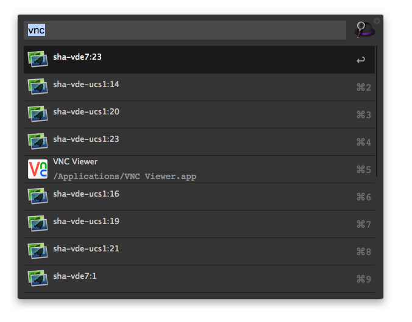
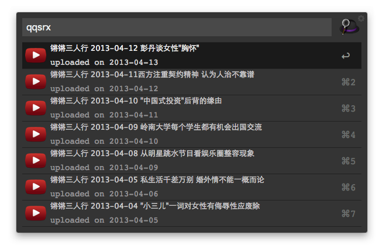
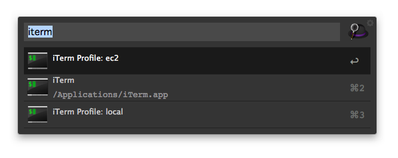

#alfred2-workflows

some workflows for alfred 2

## VNC workflow
[\[Download Link\]][1]

### Feature
* Loading all active vnc sessions in your remote host, press "enter" to login that vnc

### Dependancy
0. VNC Viewer. If not installed yet, click [here][2] to go to RealVNC VNC Viewer download page
1. SSH passwordless key exchange setup between your mac and the remote host.

### Installation

1. Install the workflow
2. Open the "Script Filter"
3. change **sample.host.com** to your host
4. Optional, you may open the "Run Script" to change the app location of VNC Viewer if it's not installed in the default location.

### Usage
5. Type "vnc" in alfred window, the active vnc session will be loaded.
6. Choose the vnc session you want to connect.

Note: VNC non-encryption warning is disabled by default.

## 锵锵三人行 workflow
[\[Download Link\]][3]

### Feature
* 列出youtube上最新的几集锵锵三人行视频
* 使用的是OnlyyouHappycamp提供是[锵锵三人行专辑][6]，在此特别感谢OnlyyouHappycamp。

### Dependancy
0. Download youtube_it gem from [here][4]
1. sudo gem install youtube_it_2.1.13.gem
2. sudo gem install xml-simple

Note: the youtube_it gem in official rubygems repository doesn't provide the latest functionality I need, so i built one by myself by compiling the latest source code from [youtube_it github repository][5]

### Installation

1. Download and double click the alfredworkflow file

### Usage
5. Type "qqsrx" in alfred window

## iTerm profile workflow
[\[Download Link\]][7]

### Feature
* List and open iTerm profiles (profile names are manually written in this workflow, since I don't know how to dynamically load from iTerm)

### Installation

1. Download and double click the alfredworkflow file

### Usage
5. Type "iterm" in alfred window

**Note**: The apple script is from reyjrar's [gist][8]

## Credits
Created by @[melvinto](https://twitter.com/melvinto 'Contact me on Twitter') under [MIT LICENSE](http://rem.mit-license.org/) 

[1]: https://github.com/MelvinTo/alfred2-workflows/raw/master/Downloads/VNC.alfredworkflow
[2]: http://www.realvnc.com/download/viewer/
[3]: https://github.com/MelvinTo/alfred2-workflows/raw/master/Downloads/qqsrx.alfredworkflow
[4]: https://github.com/MelvinTo/alfred2-workflows/raw/master/qqsrx/3rdparty/youtube_it-2.1.13.gem
[5]: https://github.com/kylejginavan/youtube_it
[6]: http://www.youtube.com/playlist?list=PLVaNxKWod1KWJkjxy6HeFck6KEUsoXf0_
[7]: https://github.com/MelvinTo/alfred2-workflows/raw/master/Downloads/iTerm.alfredworkflow
[8]: https://gist.github.com/reyjrar/1769355

